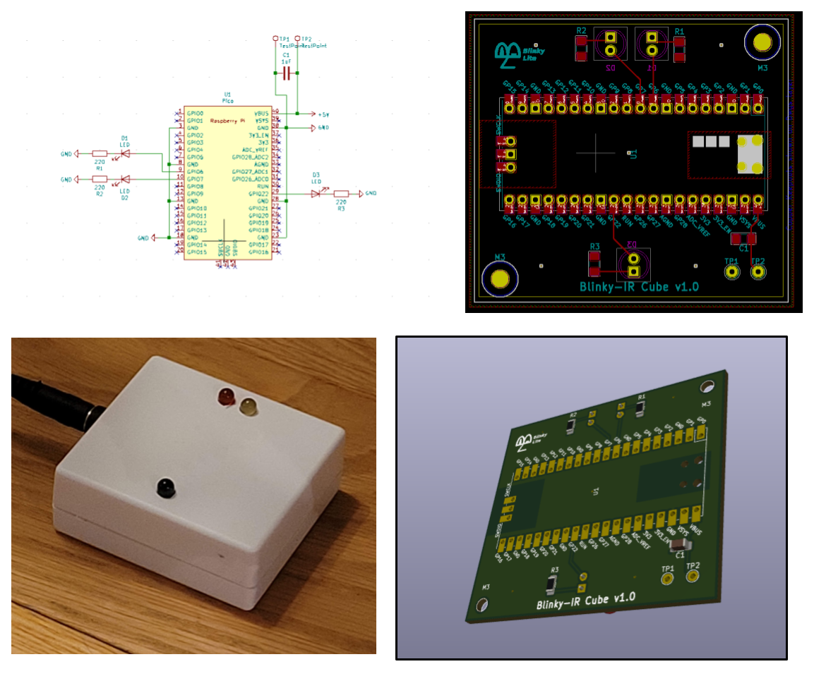

# Blinky IVT Cube

 

The Blinky-IVT cube controls an infrared diode to send pulses to an IVT heat pump. The pulse sequence is defined in the IVT.h file in the cubeCode folder. The pulse sequence was modified from [ToniA/arduino-heatpumpir](https://github.com/ToniA/arduino-heatpumpir). The microcontroller is a TeensyLC and the cube code follows closely the [Blinky Bus Cube](https://github.com/Blinky-Lite-Exchange/blinky-bus-cube) project.

The Blinky IVT Cube sends and receives data from the [Blinky IVT tray](https://github.com/blinky-lite-energy-exchange/blinky-ivt-tray).
